# UML Model
### Automotive Body Control Module (BCM) Simulator

| | |
|---|---|
| **Document ID** | BCM-UML-001 |
| **Version** | 1.0 |
| **Traces** | `BCM-SRS-001`, `BCM-ARC-001`, `BCM-ICD-001` |

Diagrams are written in Mermaid so they render directly on GitHub and stay
diffable in review — a PlantUML or Visio artefact would need a toolchain and
would drift from the code silently.

---

## 1. Package / layer view

Dependencies point downward only. This is the constraint the whole design
rests on: it is what allows every service to compile for the host.

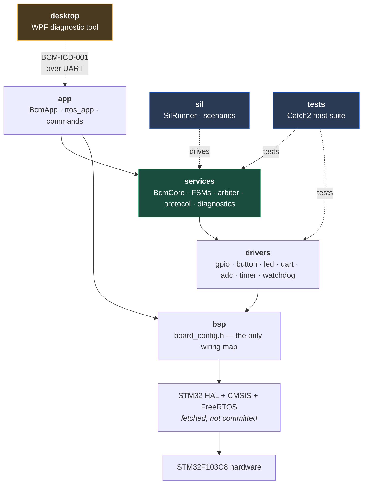

`sil` and `tests` attach to **services**, not to `app` — that is only possible
because nothing in the service layer includes a HAL header.

---

## 2. Class diagram — control core

`BcmCore` is the object both the firmware and the SIL harness drive.

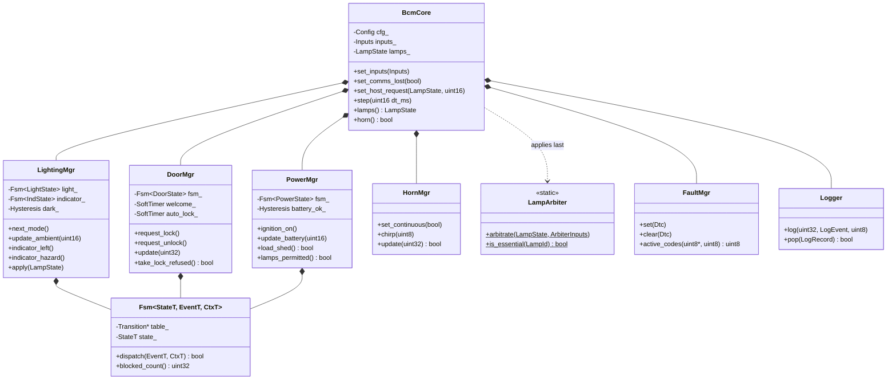

Every state machine shares one engine and differs only in its transition
table (ADR-003), which keeps behaviour declarative rather than buried in
conditionals.

---

## 3. Class diagram — driver layer

The recurring shape: hardware-free logic on the left, a thin binding on the
right. The left column is what the 189 unit tests exercise.

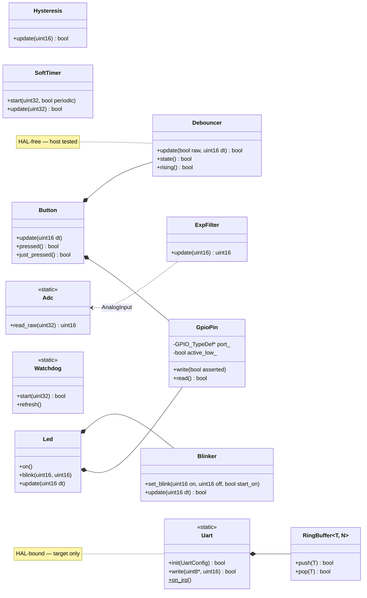

---

## 4. State machines

### 4.1 Lighting (SRS-LIGHT-001, SRS-LIGHT-003)

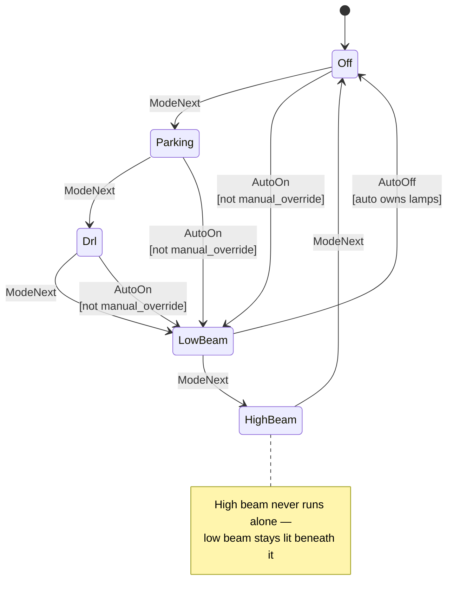

The `manual_override` guard is what stops the ambient sensor overriding a
driver who has chosen a mode by hand.

### 4.2 Indicator (SRS-IND-003)

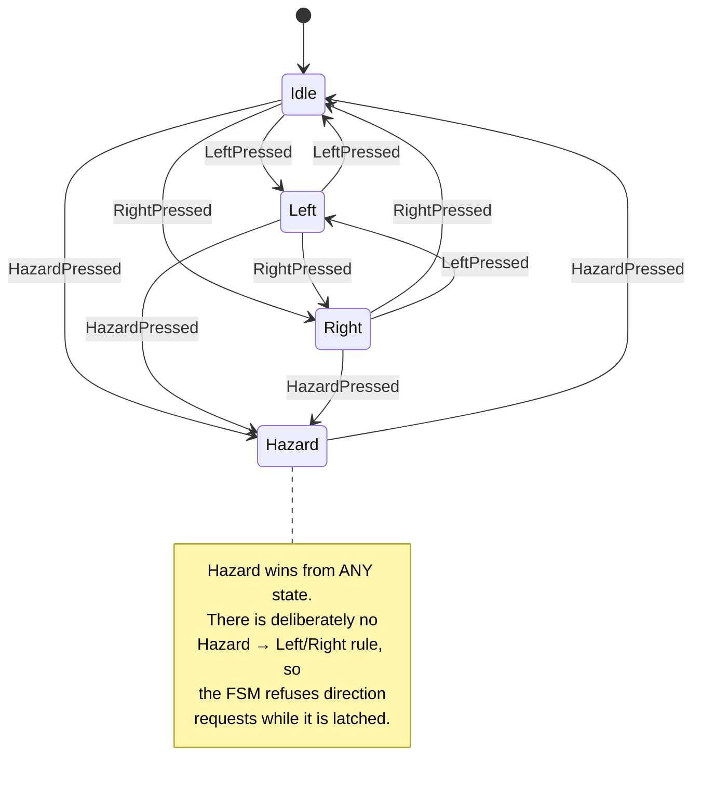

### 4.3 Door (SRS-DOOR-002 — the load-bearing guard)

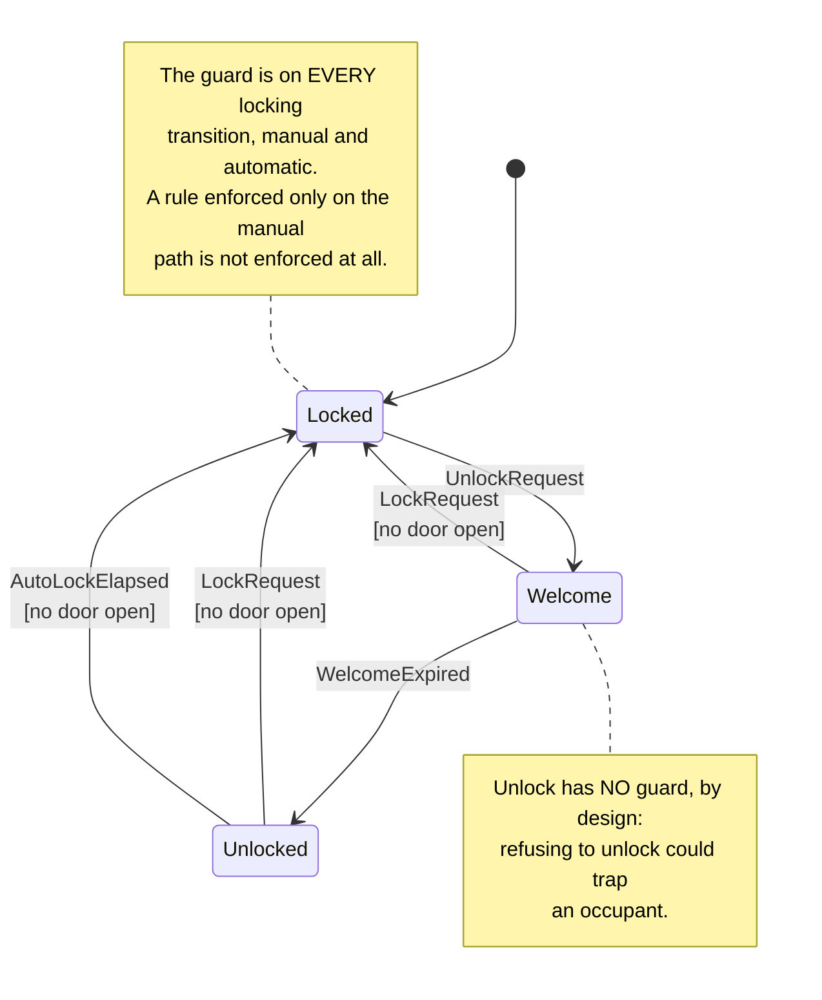

### 4.4 Power (SRS-PWR-001)

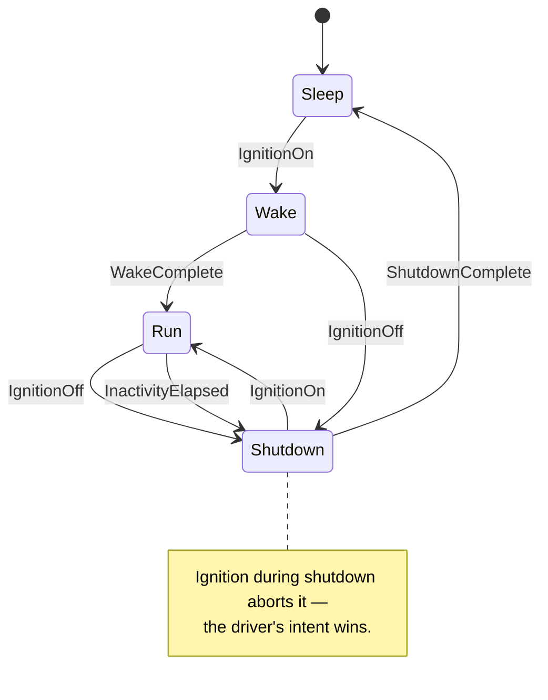

---

## 5. Sequence diagrams

### 5.1 One control cycle (5 ms)

Arbitration is deliberately the last step before the pins.

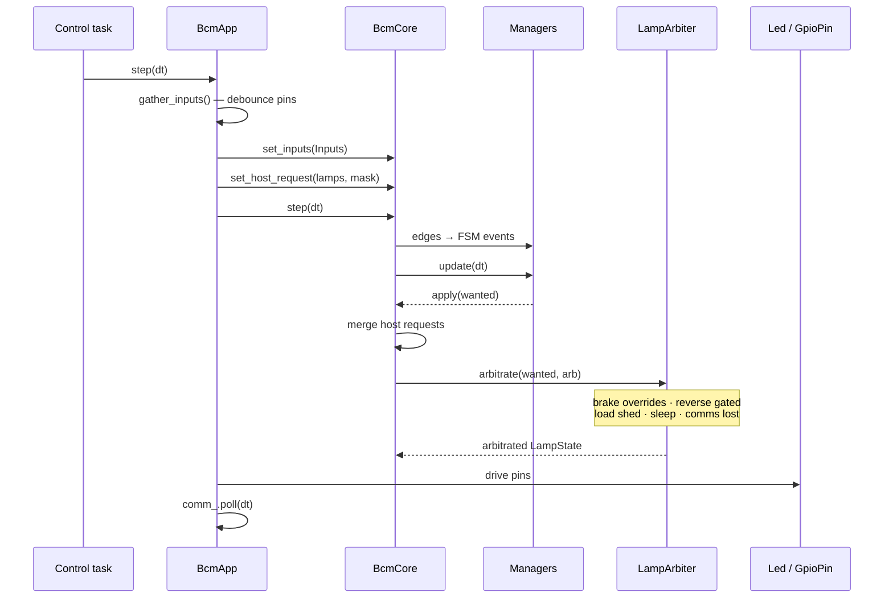

### 5.2 A diagnostic request (BCM-ICD-001)

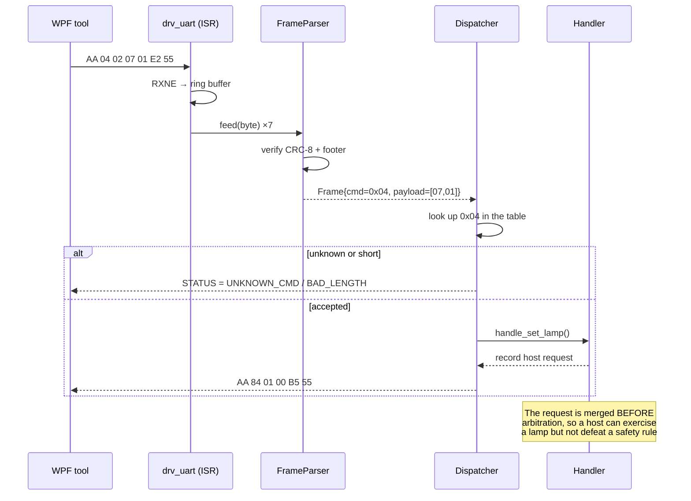

### 5.3 Watchdog supervision (SRS-SAFETY-006)

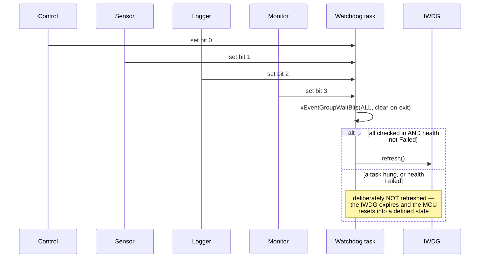

---

## 6. Concurrency view (FreeRTOS)

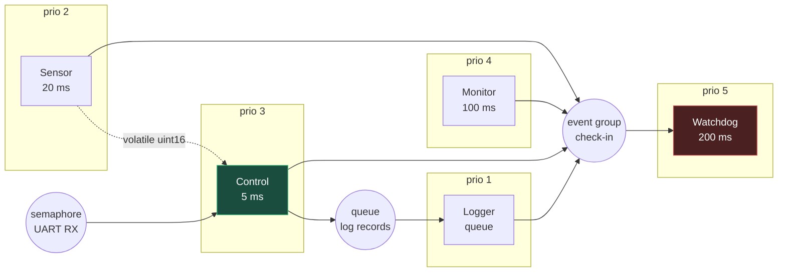

**Five tasks, not the nine in the architecture document.** Lighting, Door and
Power are merged into Control so every state machine has a single owner and
the design needs no mutex around any FSM. On a single-core M3 splitting them
would buy nothing and would reintroduce exactly the shared mutable state that
SRS-REL-002 forbids.

The battery reading crosses from Sensor to Control as a single `volatile
uint16_t` — an aligned 16-bit load/store is atomic on Cortex-M3, so no lock is
required for that either.

---

## 7. Deployment view

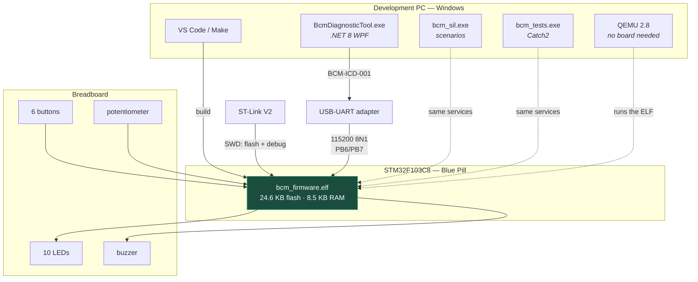

> **USART1 is remapped to PB6/PB7.** The default pins are PA9/PA10, but PA9
> drives the door-lock lamp on this board. USART2 collides with the indicator
> switches and USART3 with the beam lamps, so the AFIO remap was the only
> option. Note that the **ROM bootloader is fixed to PA9/PA10** and cannot be
> remapped — relevant only if flashing over serial instead of SWD.

---

## 8. Revision history

| Version | Change |
|---|---|
| 1.0 | Initial issue — layer, class, state, sequence, concurrency and deployment views |
